# Li-Fi: Audio Transmission over a Laser Beam

**An analog Li-Fi link that sends audio through a free-space laser beam — no radio, no microcontroller, no firmware.**

EEE 310 — Communication System I Laboratory · Bangladesh University of Engineering and Technology (BUET)
Section B2 · Group 05 · September 2026

[](https://youtu.be/T3q3XpJ2jnU)
[](docs/Group05_B2_EEE_310_Report_LiFi.pdf)
[](docs/Group05_EEE_310_B2_Final_Presentation_LiFi.pptx)
[](LICENSE)

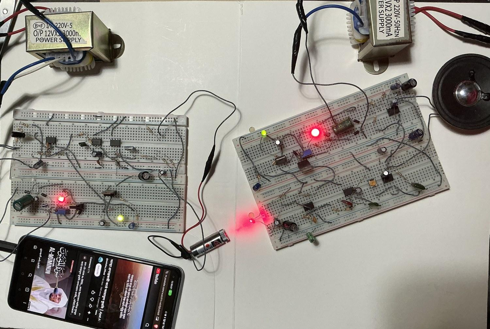

---

## Contents

- [Overview](#overview)
- [Key results](#key-results)
- [System architecture](#system-architecture)
- [Design highlights](#design-highlights)
- [Circuit and simulation](#circuit-and-simulation)
- [Hardware](#hardware)
- [Measurements](#measurements)
- [How to use the link](#how-to-use-the-link)
- [Laser safety](#laser-safety)
- [Bill of materials and cost](#bill-of-materials-and-cost)
- [Repository structure](#repository-structure)
- [Team](#team)
- [References](#references)

---

## Overview

Audio from a phone, laptop or electret microphone is amplified, band-limited, and used to modulate the **current** of a 650 nm, 5 mW laser diode through a closed-loop constant-current driver (LM358 + BD135). Because the laser is driven by current rather than voltage, optical power follows the audio signal linearly.

At the receiver, a reverse-biased **BPW34** photodiode converts the light back to a photocurrent, which is amplified by a band-pass stage, filtered by a Sallen-Key low-pass filter (≈ 10.7 kHz), and delivered to an **LM386** power amplifier driving an 8 Ω loudspeaker.

The full link was simulated in PSpice and built on breadboards.

## Key results

| Parameter | Value |
|---|---|
| Working distance | ~10 m indoors (≈ 20 m in a darkened room) |
| Measured audio bandwidth (−3 dB) | ~40 Hz – 12 kHz |
| Optical source | 650 nm, 5 mW laser diode module (Class 3R) |
| Detector | BPW34 silicon PIN photodiode (shrouded) |
| Supply | 9 V per board, separate supplies for TX and RX |
| Receiver power | 10.48 mA at 7.96 V (≈ 83 mW) |
| Prototype cost | BDT 1171 (≈ BDT 640 estimated at 1000-unit volume) |

## System architecture

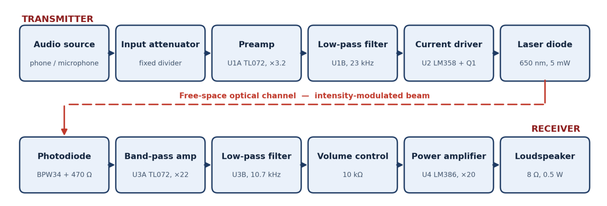

**Transmitter:** fixed attenuator → preamp (TL072 U1A, ×3.2) → Sallen-Key LPF (U1B, ~23 kHz) → constant-current laser driver (LM358 U2 + BD135 Q1) → laser diode

**Receiver:** BPW34 + 470 Ω load → band-pass amplifier (TL072 U3A, ×22, HP corner ~154 Hz) → Sallen-Key LPF (U3B, ~10.7 kHz) → 10 kΩ volume → LM386 (gain 20) → 8 Ω speaker

## Design highlights

**Linear intensity modulation.** Above threshold, P_opt ≈ η (I − I_th). The laser is biased above threshold and modulated in current, not voltage:

```
I_laser ≈ V_in / R11
V_bias  = 9 V × 10k / (68k + 10k) = 1.154 V
I_bias  = 1.154 V / 38 Ω ≈ 30 mA   (below 40 mA module rating)
```

**Staggered filters.** Sallen-Key cut-off `f_c = 1 / (2π R √(C1·C2))`, `Q = ½ √(C1/C2)`:

| Stage | R | C1 / C2 | f_c | Q |
|---|---|---|---|---|
| Transmitter LPF | 10 kΩ | 1 nF / 470 pF | ~23 kHz | 0.73 |
| Receiver LPF | 10 kΩ | 2.2 nF / 1 nF | ~10.7 kHz | 0.74 |

The sharper filter sits at the receiver, where optical-channel and detector noise can actually be removed. Cascading two identical filters would put the link 6 dB down at the nominal corner.

**Photodiode front end.** `f_detector = 1 / (2π × 470 Ω × 25 pF) ≈ 13.5 kHz`. The receiver gain stage (1 + 47k/2.2k ≈ 22) is AC-coupled with a high-pass corner at `1 / (2π × 2.2 kΩ × 470 nF) ≈ 154 Hz`, which rejects 100 Hz mains-lamp flicker and daylight DC.

**Safety by design.** The input level is set by a fixed resistive divider rather than a potentiometer, so the modulation depth — and the laser current — cannot be pushed beyond the safe rating by the user.

## Circuit and simulation

Complete PSpice schematic (transmitter top, receiver bottom). The optical channel is modelled by a current-controlled current source **F1**, so the entire link can be simulated as one circuit.

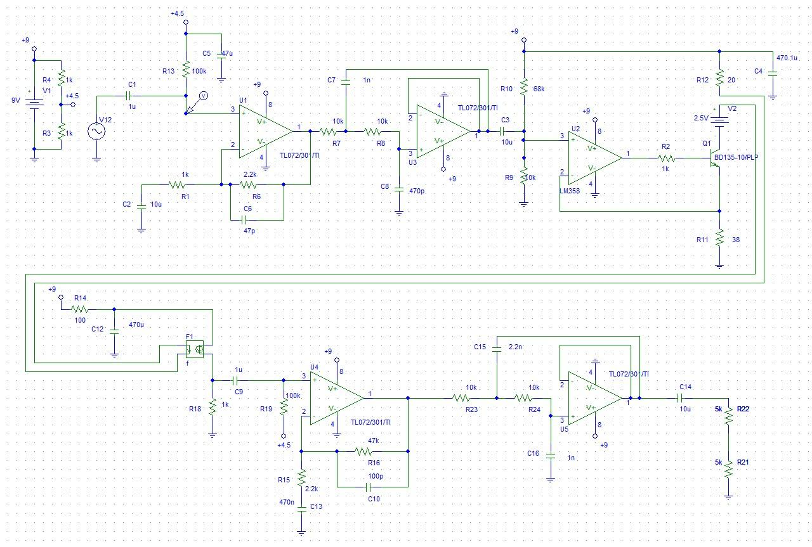

| Bias point | AC sweep (log) |
|---|---|
| 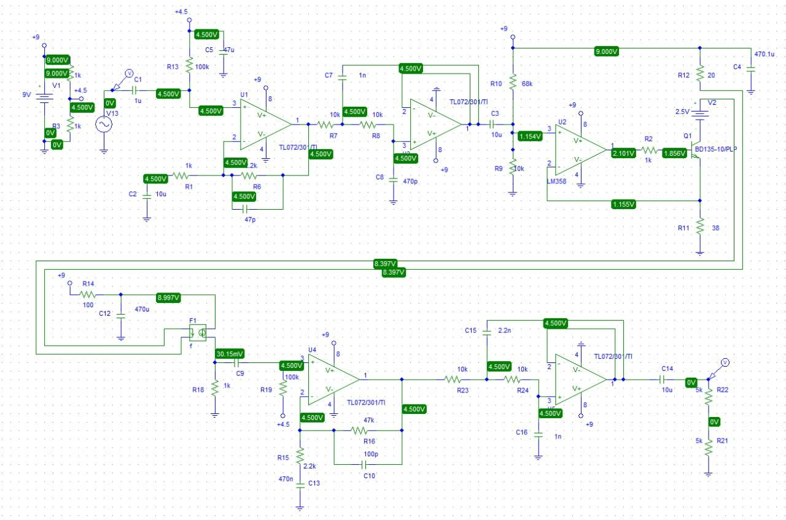 | 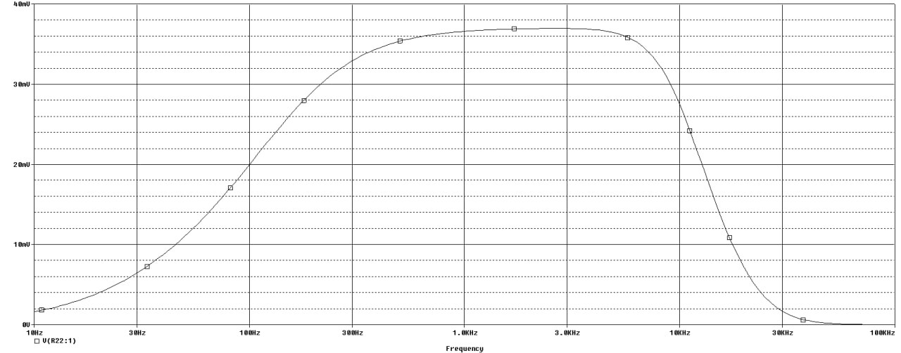 |
| **AC sweep (linear)** | **Transient, 500 Hz** |
| 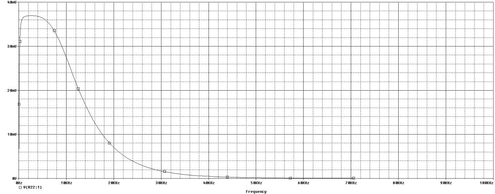 | 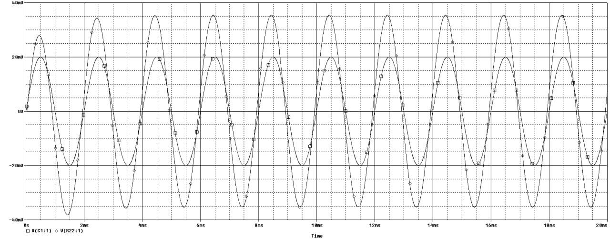 |

Bench power supply built by the group: 12 V transformer → 1N4007 bridge → 1000 µF → LM317 → 7809 (9 V rail).

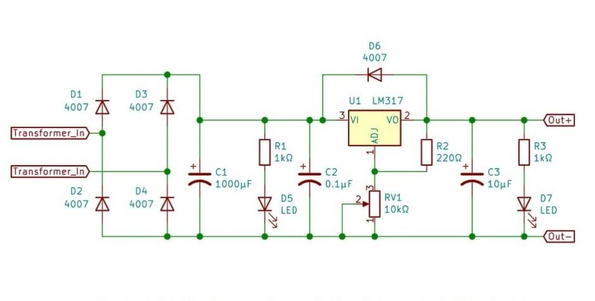

## Hardware

| Transmitter | Receiver |
|---|---|
| 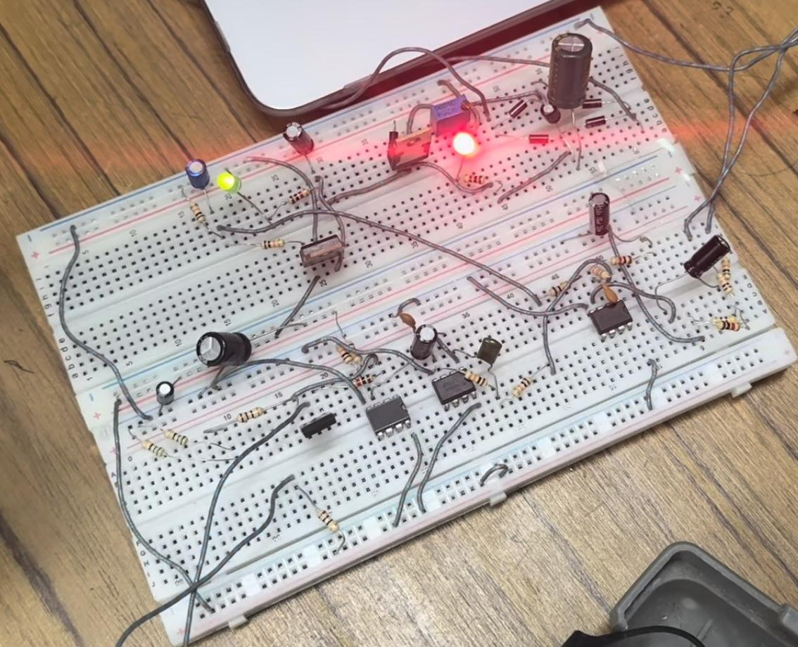 | 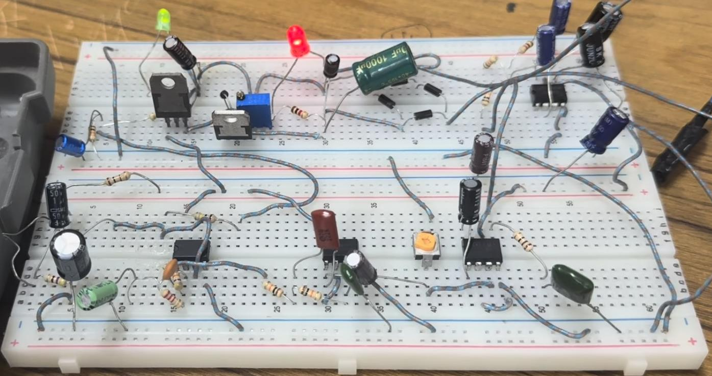 |

| Complete setup | Laser spot on the photodiode |
|---|---|
| 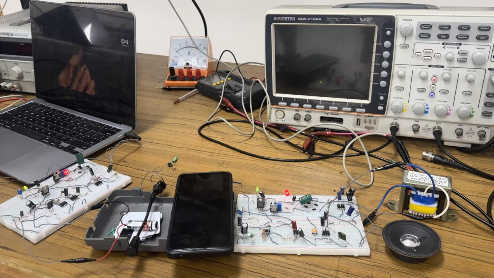 | 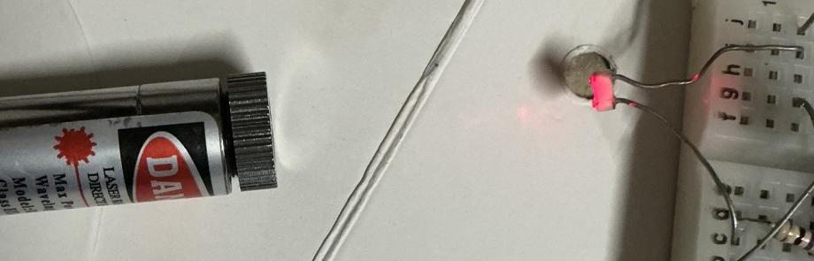 |

## Measurements

Instrument: GW Instek GDS-2104A (100 MHz DSO) and a digital multimeter. Raw tables are in [`measurements/`](measurements/).

**Signal traced through the chain**

| Preamp input (U1A pin 3) | TX filter output (U1B pin 7) | Laser current (across R11) | Photodiode node |
|---|---|---|---|
| 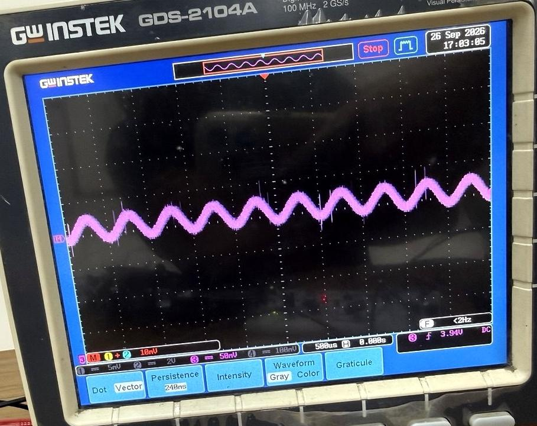 | 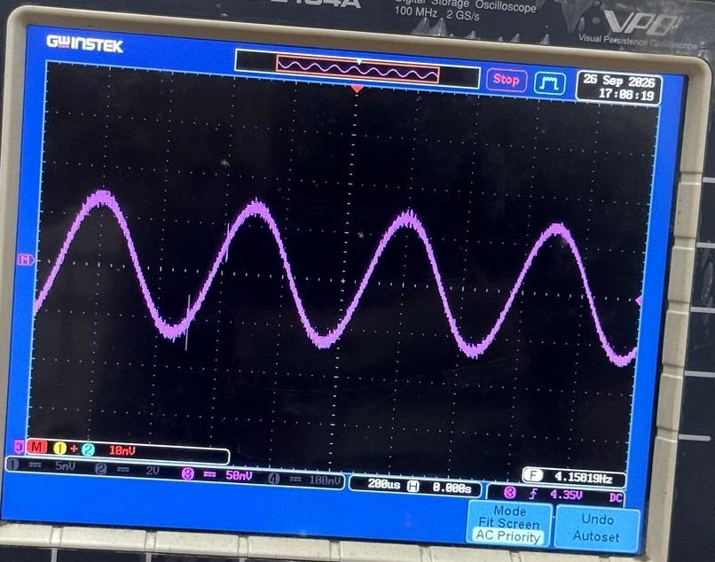 | 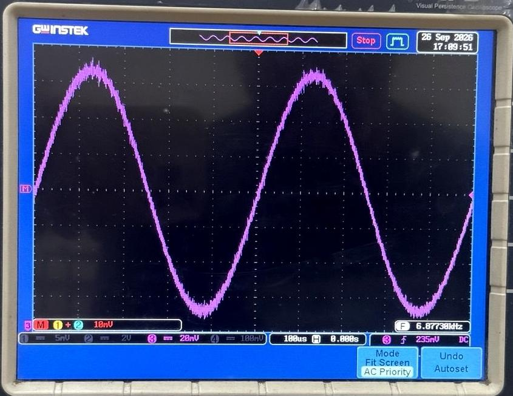 | 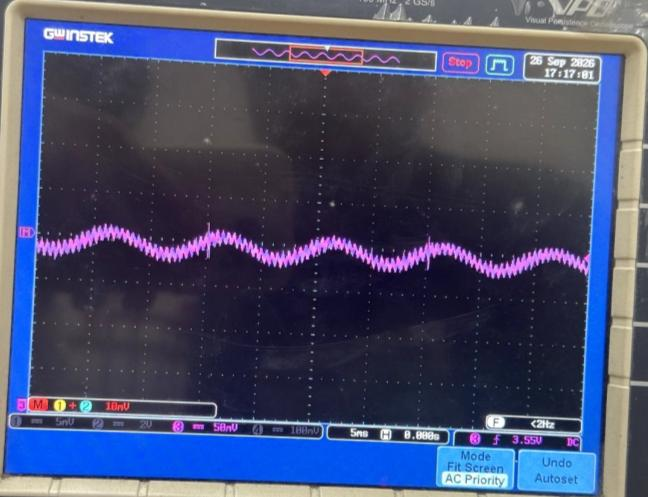 |

**Transmitted (yellow) vs recovered (magenta)**

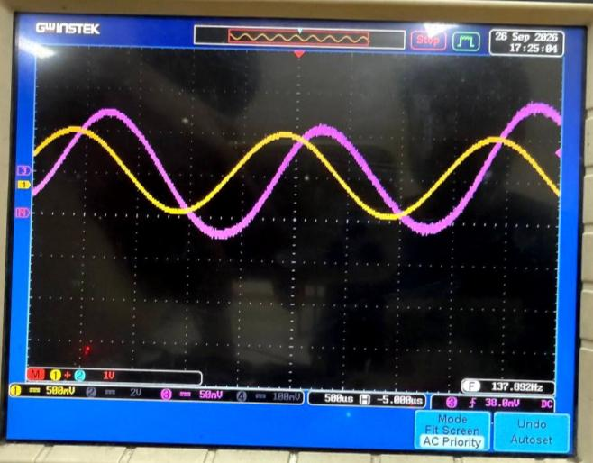

**Frequency response** — see [`images/measurements/frequency_response/`](images/measurements/frequency_response/)

| 40 Hz (lower edge) | 2.25 kHz (mid-band) | 12 kHz (upper edge) | 13 kHz (beyond cut-off) |
|---|---|---|---|
| 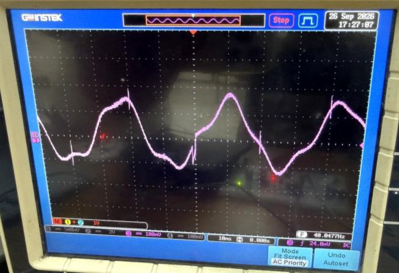 | 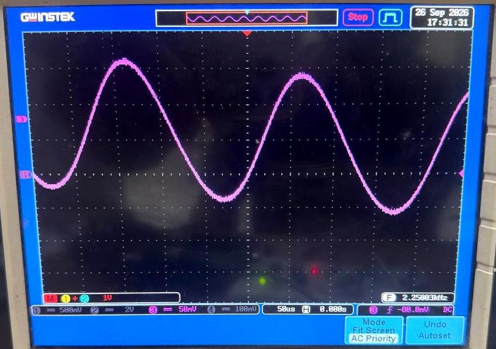 | 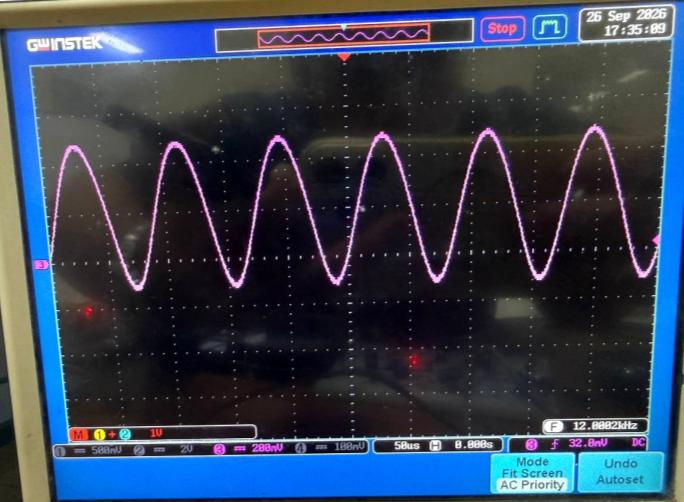 | 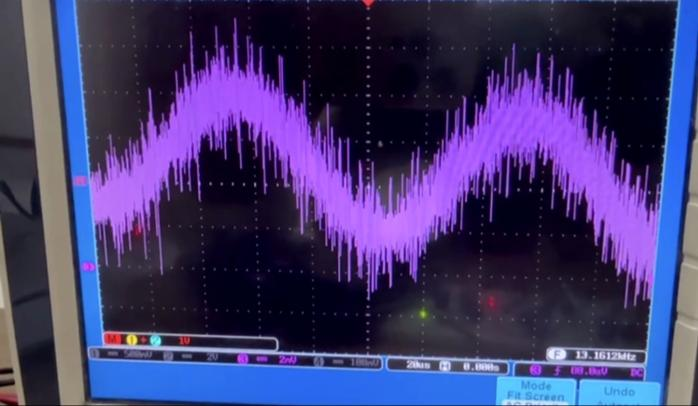 |

**Simulated vs measured**

| Quantity | Simulated | Measured | Comment |
|---|---|---|---|
| Mid-rail reference | 4.500 V | ≈ 4.4 V | Agrees |
| Driver input bias (U2 pin 3) | 1.154 V | ≈ 1.15 V | Agrees |
| Laser bias current | 30.4 mA | 7.75 mA | Large deviation — real module differs from ideal model |
| Upper −3 dB frequency | ≈ 10.7 kHz | ≈ 12 kHz | Within capacitor tolerance |
| Lower −3 dB frequency | ≈ 154 Hz | ≈ 40 Hz | Coarse scope reading + tolerance |
| Waveform fidelity at 1 kHz | No clipping | No clipping | Agrees |

**Takeaways**

- Constant-current drive was the decisive design choice — the first voltage-driven prototype was audibly distorted.
- Ambient light, not electronic noise, limits link quality in a lit room. Shrouding the detector plus the 154 Hz high-pass reduces it; an optical band-pass filter would be the next step.
- Restoring the intended ~30 mA laser bias (lower R11 or a slightly higher driver rail) would directly improve SNR.

## How to use the link

1. **Power** — connect a separate 9 V supply to each board. Do **not** join the two grounds.
2. **Check the laser** — steady red spot. Never look into the beam or its reflection; keep it below eye level.
3. **Align** — put the spot at the centre of the photodiode; nudge the receiver until the sound is loudest.
4. **Connect audio** — phone/laptop into the 3.5 mm socket (or use the microphone). Source volume about ⅓.
5. **Play** — set a comfortable level with the receiver volume. If harsh, lower the *source* volume.
6. **Best results** — dim the room lights and keep the photodiode shrouded.

**Troubleshooting:** no sound → check alignment, source and both supplies. Hum/hiss → switch off nearby lamps, re-shroud the detector. Distortion → lower the source volume.

## Laser safety

> ⚠️ A 5 mW, 650 nm laser is a **Class 3R** device. Direct or specular viewing can injure the retina.
> Keep the beam below eye level, terminate it at the detector, keep reflective objects out of the path, and never point it at a person.
> A commercial version would need IEC 60825-1 Class 3R labelling, a protective housing and a key/interlock.

## Bill of materials and cost

Full BOM: [`hardware/BOM.csv`](hardware/BOM.csv) · Development extras: [`hardware/BOM_development_extra.csv`](hardware/BOM_development_extra.csv)

| Cost element | BDT |
|---|---|
| Components in the delivered prototype | 1171 |
| Components consumed during development | 170 |
| **Total project expenditure** | **1341** |
| Estimated mass-produced unit (1000 units) | ~640 |

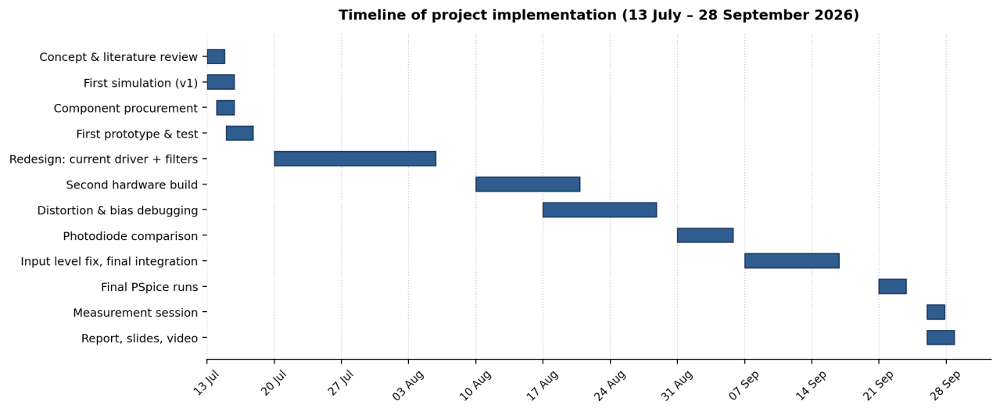

## Repository structure

```
.
├── README.md
├── LICENSE
├── docs/
│   ├── Group05_B2_EEE_310_Report_LiFi.pdf            # Final project report
│   ├── Group05_EEE_310_B2_Final_Presentation_LiFi.pptx
│   └── EEE310_Group05_Cover_Page.pdf
├── hardware/
│   ├── BOM.csv                    # Bill of materials (delivered prototype)
│   ├── BOM_development_extra.csv  # Parts consumed during development
│   └── README.md                  # Component notes, key values, build order
├── simulation/
│   └── README.md                  # PSpice analyses (place project files here)
├── measurements/                  # DC, frequency-response, detector and sim-vs-measured tables
└── images/
    ├── design/                    # Block diagram, schematic, power supply
    ├── simulation/                # PSpice bias point, AC sweep, transient
    ├── hardware/                  # Board and setup photos
    ├── measurements/              # Oscilloscope captures
    └── gantt_timeline.png
```


## References

1. B. P. Lathi and Z. Ding, *Modern Digital and Analog Communication Systems*, 4th ed., Oxford University Press, 2009.
2. S. Haykin, *Communication Systems*, 4th ed., John Wiley & Sons, 2001.
3. Texas Instruments — TL072 (SLOS080), LM358 (SNOSBT3), LM386 (SLOS264) datasheets.
4. Vishay — BPW34 Silicon PIN Photodiode datasheet (doc. 81521).
5. ON Semiconductor — BD135/BD137/BD139 datasheet.
6. IEC 60825-1: *Safety of Laser Products — Part 1*, 3rd ed., 2014.

See the [full report](docs/Group05_B2_EEE_310_Report_LiFi.pdf) for the complete reference list.
